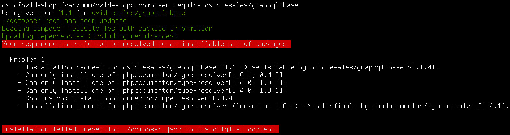

# oxid-esales/graphql-base

[](https://travis-ci.com/OXID-eSales/graphql-base-module)
[](https://github.com/oxid-esales/graphql-base-module)
[](https://packagist.org/packages/oxid-esales/graphql-base)

This module provides:
- a basic [GraphQL](https://www.graphql.org) implementation for the [OXID eShop](https://www.oxid-esales.com/)
- authorization and authentication using [JWT](https://jwt.io)
- a query to log you in and get a JWT for further authentication

## Specification of the API

See [spec](docs/SPECIFICATION.md) in this repository

## Usage

This assumes you have OXID eShop (at least `OXID-eSales/oxideshop_ce: v6.5.0` component, which is part of the `6.2.0` compilation) up and running.

### Install

```bash
$ composer require oxid-esales/graphql-base --no-update
$ composer update
```

After requiring the module, you need to head over to the OXID eShop admin and
activate the GraphQL Base module.

### How to use

You can use your favourite GraphQL client to explore the API, if you do not
already have one installed, you may use [Altair GraphQL Client](https://altair.sirmuel.design/).

To login and retrieve a token send the following GraphQL query to the server

```graphql
query {
    token (
        username: "admin",
        password: "admin"
    )
}
```

You could simply just fire up your terminal and use `curl` to do a basic check
if the GraphQL base module is up and running as epxected. To retrieve a valid
token you need to replace the username and password below with valid login
credentials.

```bash
$ curl http://oxideshop.local/widget.php?cl=graphql \
  -H 'Content-Type: application/json' \
  --data-binary '{"query":"query {token(username: \"admin\", password: \"admin\")}"}'
```

You should see a response similar to this:

```json
{
    "data": {
        "token": "a-very-long-jwt"
    }
}
```

This `token` is then to be send as your authorization with every request in the
HTTP `Authorization` header like this:

```
Authorization: Bearer a-very-long-jwt
```

### How to extend

See [oxid-esales/graphql-example](https://github.com/OXID-eSales/graphql-example-module) for an exemplary implementation.

## Testing

### Linting, syntax check, static analysis and unit tests

```bash
$ composer test
```

### Integration/Acceptance tests

- install this module into a running OXID eShop
- change the `test_config.yml`
  - add `oe/graphql-base` to the `partial_module_paths`
  - set `activate_all_modules` to `true`

```bash
$ ./vendor/bin/runtests
```

## Troubleshooting

### Apache HTTP Authorization

php-cgi under Apache does not pass HTTP Basic user/pass to PHP by default.
For this workaround to work, add these lines to your .htaccess file:

```apache
RewriteCond %{HTTP:Authorization} ^(.+)$
RewriteRule .* - [E=HTTP_AUTHORIZATION:%{HTTP:Authorization}]
```

### Query String gets swallowed

When you call the API endpoint with a query string, for example `/graphql/?lang=1` and that `lang` parameter gets swallowed by apache, it is due to the missing `QSA`-`RewriteRule`-Flag. Find the `RewriteRule` that looks like this:

```apache
RewriteRule ^(graphql/)    widget.php?cl=graphql   [NC,L]
```

and make it look like this:

```apache
RewriteRule ^(graphql/)    widget.php?cl=graphql   [QSA,NC,L]
```

### Composer can not resolve requirements



If you see something like this when trying to install the module, you tried to
install with `composer require oxid-esales/graphql-base` which is not working
correctly because `composer` will not do downgrades upon `composer require`.

## Build with

- [GraphQLite](https://graphqlite.thecodingmachine.io/)
- [lcobucci/jwt](https://github.com/lcobucci/jwt)

## License

GPLv3, see [LICENSE file](LICENSE).
