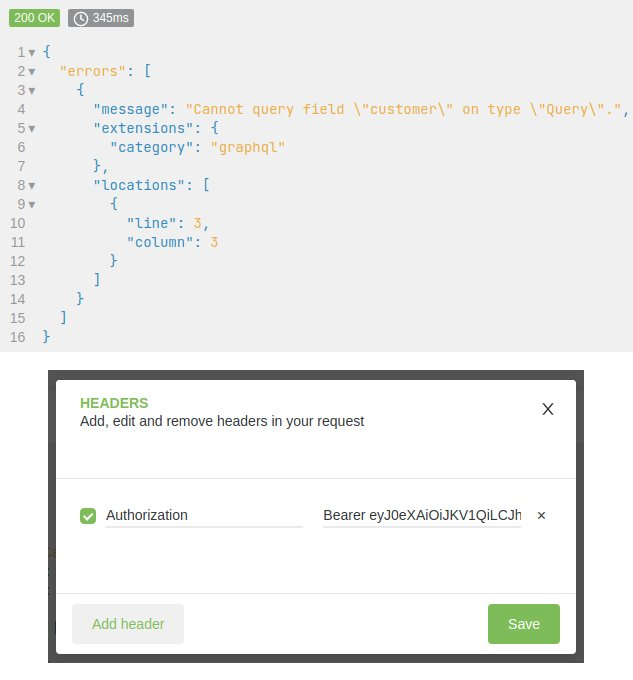

.. _troubleshooting:

Troubleshooting
===============

Authorization (Apache)
-------------------------

| If ``@Logged`` marked queries and mutations aren't callable, but the authorization token is set and valid, then this is an indication that the Apache server removes the authorization header.
| See the screenshot below for the typical behavior:

As a workaround you can add one of the two following examples (which of the two suits your requirement best) to your
webserver configuration or to the ``.htaccess`` file of the shop.

1)

  .. code-block:: apache

      RewriteCond %{HTTP:Authorization} ^(.+)$
      RewriteRule .* - [E=HTTP_AUTHORIZATION:%{HTTP:Authorization}]

2)

  .. code-block:: apache

      SetEnvIf Authorization "(.*)" HTTP_AUTHORIZATION=$1

Query String gets swallowed
---------------------------

When you call the API endpoint with a query string, for example `/graphql/?lang=1` and that `lang` parameter gets swallowed by apache, it is due to the missing `QSA`-`RewriteRule`-Flag. Find the `RewriteRule` that looks like this:

.. code-block:: apache

    RewriteRule ^(graphql/)    widget.php?cl=graphql   [NC,L]

and make it look like this:

.. code-block:: apache

    RewriteRule ^(graphql/)    widget.php?cl=graphql&skipSession=1   [QSA,NC,L]

Side-Effects due to OXID Session
--------------------------------

To enforce that PHP session is not used by accident (by sending ``sid``
parameter or cookie) and no unneeded PHP session is created, please ensure that
``skipSession=true`` parameter is sent for each request. Easiest way to do this
is to extend the shop's ``.htaccess`` file with the following lines

.. code-block:: apache

    RewriteRule ^graphql/?$    widget.php?cl=graphql&skipSession=1   [QSA,NC,L]

Otherwise in newer GraphQL versions you will be presented with an error when
sending GraphQL requests with a session id.

Maximum function nesting level is reached
-----------------------------------------

When XDebug is active, request call will take a while and eventually Xdebug will detect a possible infinite loop.
That is caused because GraphQL library tends to use a very deep stack.
Simply increase the maximum allowed nesting level in XDebug config

.. code-block:: bash

    xdebug.max_nesting_level=512

Graphql schema appears incomplete
---------------------------------

Your client's introspection requests get the available schema based upon your access rights. Make sure you are logged in and using the correct token in the ``Authorization`` header.

If you're having trouble finding admin panel requests, this could also be caused by insufficient account rights.

.. note::

    You may want to doublecheck this in the database, as the administrative dashboard setting name could be different. E.g. it could say a user has been granted ``admin`` rights, but actually they are a ``malladmin``. It is not the same and does not give enough access to query, as an example, the shop version

Installation issues for dev environment
---------------------------------------

In case you'd like to contribute, installing the modules as described in the `Oxid documentation <https://docs.oxid-esales.com/developer/en/6.0/modules/good_practices/module_setup.html>`_ might lead to your changes not being reflected or errors when activating the modules.

A more reliable first step in setting things up would be to clone the desired repository in the ``oxideshop`` directory, for example, and symlink it into its respective place in ``source\modules`` like this:

.. code-block:: bash

    cd /var/www/oxideshop
    git clone <url-to-module-repository>
    ln -s <module-directory-path> ./source/modules/<target-directory>

.. important::

    The <target-directory> should be the same as the ``target-directory`` value in the module's ``composer.json`` file, so for ``graphql-base-module`` it's ``source/modules/oe/graphql-base``.

After that, you can continue from step ``2. Register module package in project composer.json`` in the `docs <https://docs.oxid-esales.com/developer/en/6.0/modules/good_practices/module_setup.html>`_.

Allowing Cross-Origin Resource Sharing (CORS)
---------------------------------------------

In case your front-end code is served on ``sitea.intranet`` and the access to the OXID GraphQL functionality is on ``siteb.intranet``, you will need to perform cross-domain requests between ``sitea.intranet`` and ``siteb.intranet``. This may be done using `CORS headers <https://developer.mozilla.org/en-US/docs/Web/HTTP/CORS#examples_of_access_control_scenarios>`_. One way to do this is to amend the ``apache2/sites-enabled/*.conf`` file:

.. code-block:: apache

    Define APACHE_CORS_ALLOWED_DOMAINS "sitea.intranet|siteb.intranet"
    Define APACHE_CORS_ALLOWED_METHODS "POST, GET, OPTIONS"
    Define APACHE_CORS_ALLOWED_HEADERS "Content-Type, Authorization"

    <IfModule mod_headers.c>
        SetEnvIf Origin "http(s)?://(www\.)?(${APACHE_CORS_ALLOWED_DOMAINS})$" AccessControlAllowOrigin=$0
        Header always set Access-Control-Allow-Origin %{AccessControlAllowOrigin}e env=AccessControlAllowOrigin
        Header always set Access-Control-Allow-Methods "${APACHE_CORS_ALLOWED_METHODS}"
        Header always set Access-Control-Allow-Headers "${APACHE_CORS_ALLOWED_HEADERS}"
        Header merge Vary Origin
    </IfModule>

    RewriteEngine On
    RewriteCond %{REQUEST_METHOD} OPTIONS
    RewriteRule ^(.*)$ $1 [R=200,L]

.. important::
    Keep in mind that the ``mod_headers`` and ``mod_rewrite`` must be enabled on the apache server.

.. code-block:: sh

    # On Debian/Ubuntu, you can enable mod_headers & mod_rewrite, by running:
    a2enmod headers
    a2enmod rewrite
    # Restart the apache server
    apachectl -k graceful
